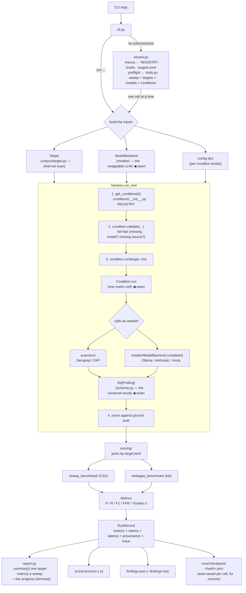

# Architecture — how vulnbench fits together

A developer onboarding guide. Read this once and you'll know where everything lives and
how to add to it. For *using* the tool (flags, models, config), see [README.md](README.md);
for the research rationale, see [`claude/`](claude/) (internal notes).

## The one-paragraph mental model

vulnbench runs a ladder of vulnerability-detection **conditions** (SAST, DAST, an unaided
LLM, and several LLM+scanner hybrids) against the *same* target app, makes every condition
emit results in *one* shape, and scores them all *the same way* against known ground truth —
recording cost (tokens) and latency along the way. The whole design exists to make that
comparison apples-to-apples.

Everything hangs off **three seams**. Learn these and the rest is plumbing:

| Seam | File | What it guarantees |
|---|---|---|
| **`Finding`** | [`schema.py`](vulnbench/schema.py) | Every condition, whatever tool it used, returns a `list[Finding]`. One shape ⇒ a SAST `file:line` and a DAST `url/param` land in the same scorecard. |
| **`ModelBackend`** | [`models/base.py`](vulnbench/models/base.py) | One `complete(messages, tools?)` call. Swapping a local model for a frontier API is a `--model` flag, not a code fork. |
| **`Condition`** | [`conditions/base.py`](vulnbench/conditions/base.py) | Every matrix cell is `run(target, ctx) -> findings + usage`. Uniform ⇒ cost and latency are measured per cell for free. |

A condition also **declares itself**: its tuning options (`knobs`), what inputs it needs
(`needs_model` / `needs_source` / `needs_url`), and which external tools it shells out to
(`tools`). That's what lets the interactive session in [`wizard.py`](vulnbench/wizard.py)
render menus, preflight dependencies, and prompt for a missing source tree *without knowing
any condition by name*. Adding a condition changes the UI for free; forgetting to declare
means your knob silently never appears.

## The pipeline at a glance

There are **two front-ends** onto the same harness. `vulnbench run …` takes flags;
a bare `vulnbench` starts the interactive session, which builds a *sweep* (many cells
across targets × models × conditions) and renders one comparative matrix. Both end up
calling `harness.run_one` per cell, so everything below is shared.



### What happens in one run (`run_one`)

1. **`cli.py`** parses args, builds a `Target`, builds a `ModelBackend` from `--model`
   (if any), and parses `--config` JSON into a knobs dict.
2. **`harness.run_one`** looks the condition up in the `REGISTRY`, calls `validate()`
   (so a missing model or source fails *before* expensive work), then `run()`.
3. The **condition** does its thing — shell out to a scanner, call the model, or both —
   and normalizes everything to `list[Finding]`.
4. **`harness._score`** picks a scorer by `target.kind` and produces `Metrics`.
5. The result is packed into a **`RunRecord`** (metrics + tokens + latency + provenance)
   and rendered by `report.py`; raw data goes to JSON files.
6. Each finished cell is written to a **checkpoint** immediately, so an interrupted sweep
   resumes instead of redoing work.

Errors in a single cell are caught and stored in `RunRecord.error` so the rest of the
matrix keeps running; pass `--debug` to re-raise them instead (use this while developing).
The same policy holds one level up: user mistakes on the command line (malformed
`--config` JSON, an unrecognized `--model` spec) exit with a one-line usage error before
any cell runs, and a backend the wizard can't build mid-sweep (missing API key or
optional package) fails only its own cells via `RunRecord.failed`.

### Two-phase conditions (`TriageCondition`)

C1 and C2 inherit [`TriageCondition`](vulnbench/conditions/base.py), which splits a run into
**scan** (run the scanner) and **triage** (model judges the scanner's output). The phases
can run *separately* (`--scan-out` then `--scan-in`) so you never need the heavy scan stack
(Docker + ZAP) and a big local model resident at the same time — the key trick on a
RAM-bound machine. C3 uses the same idea inverted: **author** rules, then **scan** with them.

## Where things live

```
vulnbench/
  cli.py                entry point: parse args, build Target + model, dispatch
  wizard.py             bare `vulnbench`: interactive sweep (menus, preflight, matrix)
  harness.py            run_one / run_matrix: time, score, pack into RunRecord
  schema.py             Finding + Location — the universal result            ◀ seam
  corpus/
    target.py           Target (what we scan) + TargetKind
  conditions/
    base.py             Condition + TriageCondition contracts + Knob         ◀ seam
    __init__.py         REGISTRY {id -> class}, get_condition()
    b1_semgrep.py       B1  SAST baseline (Semgrep)
    b2_zap.py           B2  DAST baseline (OWASP ZAP)
    b3_llm.py           B3  LLM-only (flat per-file pass)
    source_files.py     shared source-tree walking/reading + its knobs
    c1_llm_semgrep.py   C1  LLM triages Semgrep findings
    c2_llm_zap.py       C2  LLM triages ZAP findings
    c3_llm_rules.py     C3  LLM authors Semgrep rules, then Semgrep runs them
    a1_agents.py        A1  multi-agent scout → hunter → verifier
    llm_common.py       shared LLM prompt contract + JSON-reply parsing
  models/
    base.py             ModelBackend + Completion + Usage                    ◀ seam
    registry.py         build_backend("local:…" | "api:anthropic:…" | "mock")
    ollama_backend.py   local models via the Ollama HTTP API
    anthropic_backend.py  frontier models via the Anthropic API (optional dep)
    mock_backend.py     deterministic offline backend (tests / fresh checkout)
  scanners/
    semgrep_runner.py   run Semgrep, normalize JSON -> Finding  (B1/C1/C3)
    zap_runner.py       run OWASP ZAP, normalize alerts -> Finding  (B2/C2)
    benchmark_crawl.py  seed ZAP from the OWASP Benchmark crawler XML
  scoring/
    metrics_unifier.py  Metrics: precision / recall / F1 / FPR / Youden-J
    owasp_benchmark.py  score vs expectedresults CSV     (--kind benchmark)
    webapps_benchmark.py  fuzzy list-match for realistic apps  (--kind realistic)
  checkpoint.py         crash-safe resume between runs (signature-keyed)
  report.py             progress bar + summary/matrix tables (rich, optional)
  theme.py              shared CLI look: palette, mascot banner, color
  tui.py                reusable multi-select menu + prompts (raw TTY, text fallback)
  tools.py              external deps (semgrep / ZAP / Ollama): detect, install, hint
  suite.py              `vulnbench targets` — opt-in app manager
  targets.toml          the test-app catalog (edit to add apps)
```

## Common tasks (recipes)

### Add a new condition (a new matrix cell)

1. Create `conditions/x9_thing.py` with a class subclassing `Condition` (or
   `TriageCondition` if it's scanner-then-model) and implement
   `run(self, target, ctx) -> ConditionResult`.
2. **Declare what it is and what it needs** — this is what the CLI and the interactive
   session read, so nothing else needs editing:

   ```python
   class X9Thing(Condition):
       id = "X9"
       label = "Thing (one line, shown in every menu)"
       needs_model = True          # a --model is required
       needs_source = True         # a source tree is required (or needs_url for DAST)
       tools = ("semgrep",)        # external deps, preflighted before a run
       knobs = (
           Knob("max_hops", "int", 3, help="how far to follow a taint chain"),
       )
   ```

   Read knobs with `self.cfg(ctx, "max_hops")`, **never** `ctx.config.get("max_hops", 3)`.
   The `Knob`'s `default` is the single source of truth: `cfg()` falls back to it, so the
   value a menu displays and the value your code uses cannot drift apart. A test
   (`test_every_cfg_read_names_a_declared_knob`) fails if you read an undeclared knob.
3. Return findings as `list[Finding]`. For LLM conditions, reuse
   `llm_common.SYSTEM_PROMPT` / `OUTPUT_CONTRACT` / `parse_findings()` so your output
   is scored like the others.
4. Register it in [`conditions/__init__.py`](vulnbench/conditions/__init__.py) `REGISTRY`.
5. Add a test in `tests/` (use `--model mock` / `MockBackend` so it runs offline).

That's it — `cli.py`, `harness.py`, scoring, the report, and every wizard menu (including
the knob prompts and the dependency preflight) pick it up automatically.

> Needs a tool nobody uses yet? Add a `Tool` to [`tools.py`](vulnbench/tools.py) with a
> `check`, an optional `install_cmd`, and a `hint`, then name its key in `tools`. Give a
> daemon (not a package) a `startup_wait` so the probe polls while it boots. If the
> command depends on the machine's current state (Docker running, a compose file present),
> supply `install_cmd_factory` instead — it's re-evaluated when the user is actually asked.

### Add a new model backend (e.g. OpenAI, vLLM)

1. Create `models/your_backend.py` with a class subclassing `ModelBackend`; implement
   `_complete(messages, tools?) -> Completion`. (The base `complete()` stamps latency
   for you — don't override it.) Set `self.name` to a scorecard-friendly id.
2. Wire a spec prefix into [`models/registry.py`](vulnbench/models/registry.py)
   `build_backend()` (e.g. `api:openai:` → your class), and teach `is_valid_spec()`
   the same grammar — that's what lets the wizard reject a typo at entry time.
3. Report `Usage(input_tokens, output_tokens)` so cost metrics keep working.

No condition or scoring code changes.

### Add a new scoring shape / corpus

1. Add a value to `TargetKind` in [`corpus/target.py`](vulnbench/corpus/target.py).
2. Add a loader + scorer in `scoring/` returning `Metrics`.
3. Hook it into `harness._score` (currently a small `if/else` on `target.kind`).

> Heads-up: the OWASP-Benchmark test-case id convention currently lives in
> `schema.py` (`benchmark_case_of`). A genuinely different corpus means teaching your
> scorer that id mapping rather than relying on the schema's built-in one.

## Conventions & gotchas a new dev should know

- **Stdlib-only core.** The harness imports and runs with zero third-party packages.
  Backends/scanners shell out or use `urllib`; `rich` is an *optional* extra that the
  reporter degrades gracefully without. Don't add a hard third-party import to the core
  path — put it behind an optional extra and a lazy import (see `anthropic_backend.py`).
- **Knobs are declared, not improvised.** Every option a condition accepts is a `Knob` in
  its `knobs` tuple, read back via `self.cfg(ctx, name)`. `Condition.all_knobs()` merges
  the MRO, so `TriageCondition` hands `scan_out`/`scan_in` to C1 and C2 without either
  restating them. Mark plumbing knobs (file handoff between phases) `advanced=True` to keep
  them out of the wizard's tuning menu.
- **`--config` keys are checked against declared knobs.** The CLI rejects a key that none
  of the chosen conditions declare (so a typo like `max_file` vs `max_files` errors up
  front instead of silently running with the default); the wizard only offers declared
  knobs in the first place. Full list: the README's Configuration table.
- **Shared helpers have real homes.** Source-tree walking/reading (`iter_source_files`,
  `read_capped`, `SCAN_KNOBS`) lives in `conditions/source_files.py`; JSON parsing in
  `llm_common.py`. The ZAP driver (`_run_zap_from_config`, `ZAP_KNOBS`) still lives with
  its first user in `b2_zap.py` — C2 imports it — since it's only shared by that pair.
- **`validate()` fails fast, and mostly writes itself.** Set `needs_model` /
  `needs_source` / `needs_url` and the base class raises an actionable error before any
  expensive work — no condition below needs its own `validate()`. Override it only when a
  knob *relaxes* a requirement, and push the rule as far up as it applies: `scan_in` means
  no scanner input is needed, so `TriageCondition` handles that once for both C1 and C2;
  only C3 (whose `rules_in` needs no model) overrides it directly.
- **Preflight beats a traceback.** Anything a condition shells out to belongs in `tools`,
  so a missing scanner is a prompt at second zero rather than a stack trace thirty minutes
  into a sweep.
- **Reproducibility is the point.** Sorted file iteration, frozen config in provenance,
  and recorded tool versions all exist so a scored run is repeatable. Preserve that when
  you add capped/sampled behavior.

## Dev loop

```bash
python3 -m venv .venv && .venv/bin/pip install -e '.[dev,pretty]'
.venv/bin/pip install semgrep                 # only if you touch B1/C1/C3

.venv/bin/python -m pytest -q                 # 100% offline (mock model)
.venv/bin/ruff check vulnbench tests          # lint: line-length 100, import order
```

Use `--model mock` for an end-to-end run with no server or keys. Both checks above are
exactly what CI runs on every PR (see the workflow below), so run them before you push.

This repo is developed with Claude Code; the code-quality passes are **slash-commands**
you run inside a Claude Code session (not shell scripts):

| Command | What it does |
|---------|--------------|
| `/simplify` | reuse / simplification / efficiency cleanup of the current diff, then applies fixes |
| `/code-review` | reviews the diff for correctness bugs (`--fix` to apply, `--comment` to post on a PR) |
| `/security-review` | security review of the pending changes |

## Working on this repo (contribution workflow)

`main` is **branch-protected** — nobody pushes to it directly. Every change lands through a
pull request that passes CI and review. The whole flow, end to end:

**1 — One branch, one PR, one condition.** Branch off an up-to-date `main` and name the
branch for the work (`a4-rag`, `a8-cot`, …):

```bash
git checkout main && git pull
git checkout -b a4-rag
```

Keep a PR to a single condition: its new `conditions/xN_thing.py`, its test, and the one
`REGISTRY` line (see "Add a new condition" above). Small, single-purpose PRs review fast and
don't collide — the only file two contributors touch in common is `conditions/__init__.py`
(the registry), and a one-line conflict there is trivial to resolve.

**2 — Before you push, run what CI runs.** A PR can't merge until CI is green:
`ruff check vulnbench tests` and `pytest -q`, across Python 3.11 / 3.12 / 3.13
(`.github/workflows/ci.yml`). Run both locally first so the PR goes green on the first try.

**3 — Open the PR against `main`.** To merge it needs:

- **CI green** — the three `lint-and-test` jobs.
- **Approving review(s)** — the repo requires approvals from other collaborators (a PR author
  can't approve their own PR).
- **Code-owner review where it applies** — if your PR touches a frozen core path, the code
  owner (see [`.github/CODEOWNERS`](.github/CODEOWNERS)) must approve. Adding a condition
  normally touches only your new file + the one registry line; the registry line lives in a
  co-owned file, so expect a maintainer review on that.

Merges are **squashed** — your branch history doesn't need to be tidy; one clean commit lands
on `main` per PR. Write a clear PR title and description.

**4 — Don't touch the frozen core.** The harness, scoring, model backends, `schema.py`, and
the `Condition` contract (`base.py` + the registry) are stable API your condition builds
*on top of* — they should not change as part of adding a condition. If you think a core
change is genuinely needed, raise it (an issue / a note to the maintainer) *before* opening
a PR, not as a drive-by edit.

**5 — New dependencies go behind an optional extra + a lazy import.** The core is
stdlib-only (see the conventions above). If your condition needs a library (embeddings, a
parser, …), declare it as an optional extra in `pyproject.toml`
(`[project.optional-dependencies] a4 = ["…"]`) and import it *inside* `run()`, raising an
actionable "pip install vulnbench[a4]" if it's missing — never add a hard third-party import
to the core path, or you break `import vulnbench` for everyone else.

See [README.md](README.md) for the full usage, configuration, and the `targets` app manager.
